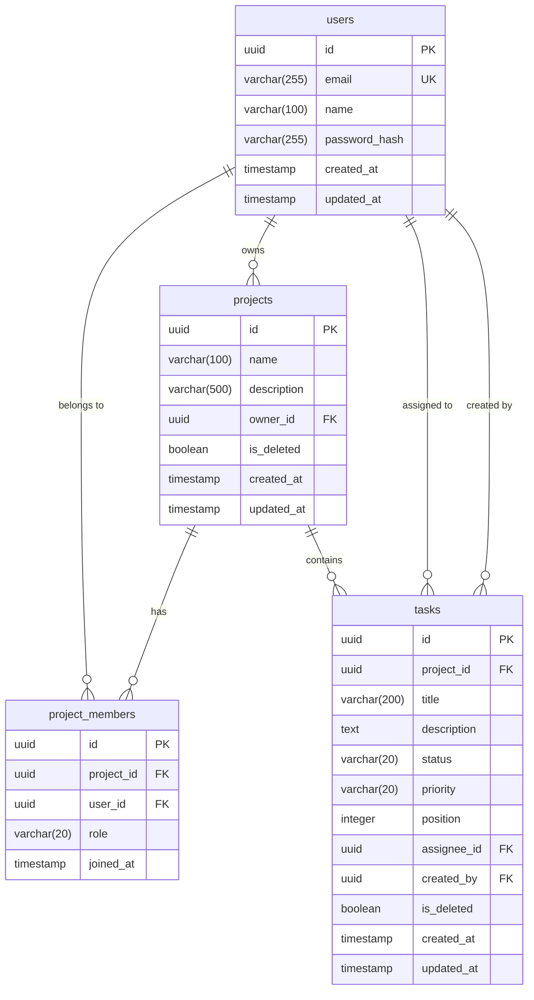

# 데이터베이스 스키마 설계 (Database Schema)

## 프로젝트: TaskFlow — 태스크 관리 SaaS

> DB: PostgreSQL 16
> ORM: SQLAlchemy 2.x

---

## 1. ERD (Entity Relationship Diagram)



---

## 2. 테이블 정의

### 2.1 users (사용자)

사용자 계정 정보를 저장한다.

```sql
CREATE TABLE users (
    id          UUID PRIMARY KEY DEFAULT gen_random_uuid(),
    email       VARCHAR(255) NOT NULL,
    name        VARCHAR(100) NOT NULL,
    password_hash VARCHAR(255) NOT NULL,
    created_at  TIMESTAMP WITH TIME ZONE NOT NULL DEFAULT NOW(),
    updated_at  TIMESTAMP WITH TIME ZONE NOT NULL DEFAULT NOW(),

    CONSTRAINT uq_users_email UNIQUE (email)
);

-- 인덱스
CREATE INDEX idx_users_email ON users (email);
CREATE INDEX idx_users_created_at ON users (created_at);
```

| 컬럼 | 타입 | NULL | 기본값 | 설명 |
|------|------|------|--------|------|
| `id` | UUID | NO | `gen_random_uuid()` | PK |
| `email` | VARCHAR(255) | NO | - | 이메일 (유니크) |
| `name` | VARCHAR(100) | NO | - | 사용자 이름 |
| `password_hash` | VARCHAR(255) | NO | - | bcrypt 해시된 비밀번호 |
| `created_at` | TIMESTAMPTZ | NO | `NOW()` | 생성 시각 |
| `updated_at` | TIMESTAMPTZ | NO | `NOW()` | 수정 시각 |

---

### 2.2 projects (프로젝트)

프로젝트 정보를 저장한다.

```sql
CREATE TABLE projects (
    id          UUID PRIMARY KEY DEFAULT gen_random_uuid(),
    name        VARCHAR(100) NOT NULL,
    description VARCHAR(500),
    owner_id    UUID NOT NULL,
    is_deleted  BOOLEAN NOT NULL DEFAULT FALSE,
    created_at  TIMESTAMP WITH TIME ZONE NOT NULL DEFAULT NOW(),
    updated_at  TIMESTAMP WITH TIME ZONE NOT NULL DEFAULT NOW(),

    CONSTRAINT fk_projects_owner
        FOREIGN KEY (owner_id) REFERENCES users (id)
        ON DELETE RESTRICT
);

-- 인덱스
CREATE INDEX idx_projects_owner_id ON projects (owner_id);
CREATE INDEX idx_projects_is_deleted ON projects (is_deleted) WHERE is_deleted = FALSE;
CREATE INDEX idx_projects_created_at ON projects (created_at);
```

| 컬럼 | 타입 | NULL | 기본값 | 설명 |
|------|------|------|--------|------|
| `id` | UUID | NO | `gen_random_uuid()` | PK |
| `name` | VARCHAR(100) | NO | - | 프로젝트명 |
| `description` | VARCHAR(500) | YES | NULL | 프로젝트 설명 |
| `owner_id` | UUID | NO | - | 소유자 (FK → users.id) |
| `is_deleted` | BOOLEAN | NO | `FALSE` | 소프트 삭제 플래그 |
| `created_at` | TIMESTAMPTZ | NO | `NOW()` | 생성 시각 |
| `updated_at` | TIMESTAMPTZ | NO | `NOW()` | 수정 시각 |

---

### 2.3 project_members (프로젝트 멤버)

프로젝트와 사용자 간의 다대다 관계를 저장한다.

```sql
CREATE TABLE project_members (
    id          UUID PRIMARY KEY DEFAULT gen_random_uuid(),
    project_id  UUID NOT NULL,
    user_id     UUID NOT NULL,
    role        VARCHAR(20) NOT NULL DEFAULT 'member',
    joined_at   TIMESTAMP WITH TIME ZONE NOT NULL DEFAULT NOW(),

    CONSTRAINT fk_pm_project
        FOREIGN KEY (project_id) REFERENCES projects (id)
        ON DELETE CASCADE,
    CONSTRAINT fk_pm_user
        FOREIGN KEY (user_id) REFERENCES users (id)
        ON DELETE CASCADE,
    CONSTRAINT uq_pm_project_user
        UNIQUE (project_id, user_id),
    CONSTRAINT chk_pm_role
        CHECK (role IN ('owner', 'member'))
);

-- 인덱스
CREATE INDEX idx_pm_project_id ON project_members (project_id);
CREATE INDEX idx_pm_user_id ON project_members (user_id);
```

| 컬럼 | 타입 | NULL | 기본값 | 설명 |
|------|------|------|--------|------|
| `id` | UUID | NO | `gen_random_uuid()` | PK |
| `project_id` | UUID | NO | - | 프로젝트 (FK → projects.id) |
| `user_id` | UUID | NO | - | 사용자 (FK → users.id) |
| `role` | VARCHAR(20) | NO | `'member'` | 역할 (`owner` / `member`) |
| `joined_at` | TIMESTAMPTZ | NO | `NOW()` | 참가 시각 |

---

### 2.4 tasks (태스크)

프로젝트 내 태스크 정보를 저장한다.

```sql
CREATE TABLE tasks (
    id          UUID PRIMARY KEY DEFAULT gen_random_uuid(),
    project_id  UUID NOT NULL,
    title       VARCHAR(200) NOT NULL,
    description TEXT,
    status      VARCHAR(20) NOT NULL DEFAULT 'TODO',
    priority    VARCHAR(20) NOT NULL DEFAULT 'MEDIUM',
    position    INTEGER NOT NULL DEFAULT 0,
    assignee_id UUID,
    created_by  UUID NOT NULL,
    is_deleted  BOOLEAN NOT NULL DEFAULT FALSE,
    created_at  TIMESTAMP WITH TIME ZONE NOT NULL DEFAULT NOW(),
    updated_at  TIMESTAMP WITH TIME ZONE NOT NULL DEFAULT NOW(),

    CONSTRAINT fk_tasks_project
        FOREIGN KEY (project_id) REFERENCES projects (id)
        ON DELETE CASCADE,
    CONSTRAINT fk_tasks_assignee
        FOREIGN KEY (assignee_id) REFERENCES users (id)
        ON DELETE SET NULL,
    CONSTRAINT fk_tasks_created_by
        FOREIGN KEY (created_by) REFERENCES users (id)
        ON DELETE RESTRICT,
    CONSTRAINT chk_tasks_status
        CHECK (status IN ('TODO', 'IN_PROGRESS', 'DONE')),
    CONSTRAINT chk_tasks_priority
        CHECK (priority IN ('LOW', 'MEDIUM', 'HIGH', 'URGENT'))
);

-- 인덱스
CREATE INDEX idx_tasks_project_id ON tasks (project_id);
CREATE INDEX idx_tasks_status ON tasks (status);
CREATE INDEX idx_tasks_assignee_id ON tasks (assignee_id);
CREATE INDEX idx_tasks_created_by ON tasks (created_by);
CREATE INDEX idx_tasks_is_deleted ON tasks (is_deleted) WHERE is_deleted = FALSE;
CREATE INDEX idx_tasks_project_status ON tasks (project_id, status) WHERE is_deleted = FALSE;
CREATE INDEX idx_tasks_project_position ON tasks (project_id, status, position) WHERE is_deleted = FALSE;
```

| 컬럼 | 타입 | NULL | 기본값 | 설명 |
|------|------|------|--------|------|
| `id` | UUID | NO | `gen_random_uuid()` | PK |
| `project_id` | UUID | NO | - | 소속 프로젝트 (FK → projects.id) |
| `title` | VARCHAR(200) | NO | - | 태스크 제목 |
| `description` | TEXT | YES | NULL | 태스크 설명 |
| `status` | VARCHAR(20) | NO | `'TODO'` | 상태 (`TODO` / `IN_PROGRESS` / `DONE`) |
| `priority` | VARCHAR(20) | NO | `'MEDIUM'` | 우선순위 (`LOW` / `MEDIUM` / `HIGH` / `URGENT`) |
| `position` | INTEGER | NO | `0` | 컬럼 내 표시 순서 (오름차순) |
| `assignee_id` | UUID | YES | NULL | 담당자 (FK → users.id) |
| `created_by` | UUID | NO | - | 생성자 (FK → users.id) |
| `is_deleted` | BOOLEAN | NO | `FALSE` | 소프트 삭제 플래그 |
| `created_at` | TIMESTAMPTZ | NO | `NOW()` | 생성 시각 |
| `updated_at` | TIMESTAMPTZ | NO | `NOW()` | 수정 시각 |

---

## 3. 관계 정의

| 관계 | 설명 | 카디널리티 |
|------|------|-----------|
| users → projects | 사용자가 프로젝트를 소유한다 | 1:N |
| users ↔ projects (via project_members) | 사용자가 프로젝트에 속한다 | M:N |
| projects → tasks | 프로젝트가 태스크를 포함한다 | 1:N |
| users → tasks (assignee) | 사용자에게 태스크가 할당된다 | 1:N |
| users → tasks (created_by) | 사용자가 태스크를 생성한다 | 1:N |

### 외래 키 삭제 전략

| FK | ON DELETE | 이유 |
|----|-----------|------|
| `projects.owner_id` → `users.id` | RESTRICT | 소유자 삭제 시 프로젝트 보호 |
| `project_members.project_id` → `projects.id` | CASCADE | 프로젝트 삭제 시 멤버 관계도 삭제 |
| `project_members.user_id` → `users.id` | CASCADE | 사용자 삭제 시 멤버 관계도 삭제 |
| `tasks.project_id` → `projects.id` | CASCADE | 프로젝트 삭제 시 태스크도 삭제 |
| `tasks.assignee_id` → `users.id` | SET NULL | 담당자 삭제 시 할당 해제 |
| `tasks.created_by` → `users.id` | RESTRICT | 생성자 삭제 시 태스크 보호 |

---

## 4. 인덱스 전략

### 4.1 기본 인덱스

모든 PK는 자동으로 B-Tree 인덱스가 생성된다. UNIQUE 제약 조건도 마찬가지이다.

### 4.2 조회 최적화 인덱스

| 인덱스 | 대상 컬럼 | 목적 |
|--------|-----------|------|
| `idx_users_email` | `users.email` | 로그인 시 이메일로 사용자 조회 |
| `idx_projects_owner_id` | `projects.owner_id` | 소유한 프로젝트 조회 |
| `idx_pm_project_id` | `project_members.project_id` | 프로젝트별 멤버 조회 |
| `idx_pm_user_id` | `project_members.user_id` | 사용자가 속한 프로젝트 조회 |
| `idx_tasks_project_id` | `tasks.project_id` | 프로젝트별 태스크 조회 |
| `idx_tasks_assignee_id` | `tasks.assignee_id` | 담당자별 태스크 조회 |
| `idx_tasks_status` | `tasks.status` | 상태별 태스크 필터링 |

### 4.3 부분 인덱스 (Partial Index)

소프트 삭제된 레코드를 제외하여 인덱스 크기를 줄이고 조회 성능을 높인다.

| 인덱스 | 조건 | 목적 |
|--------|------|------|
| `idx_projects_is_deleted` | `WHERE is_deleted = FALSE` | 삭제되지 않은 프로젝트만 조회 |
| `idx_tasks_is_deleted` | `WHERE is_deleted = FALSE` | 삭제되지 않은 태스크만 조회 |
| `idx_tasks_project_status` | `WHERE is_deleted = FALSE` | 칸반 보드 렌더링 (프로젝트 + 상태별) |
| `idx_tasks_project_position` | `WHERE is_deleted = FALSE` | 칸반 보드 카드 정렬 (프로젝트 + 상태 + 순서) |

### 4.4 복합 인덱스

| 인덱스 | 컬럼 | 목적 |
|--------|------|------|
| `idx_tasks_project_status` | `(project_id, status)` | 칸반 보드에서 프로젝트 내 상태별 태스크 조회 |
| `idx_tasks_project_position` | `(project_id, status, position)` | 상태별 태스크 순서 정렬 |
| `uq_pm_project_user` | `(project_id, user_id)` | 동일 프로젝트 중복 가입 방지 |

---

## 5. 전체 스키마 SQL

아래는 전체 스키마를 한번에 생성하는 SQL이다.

```sql
-- UUID 확장 활성화 (PostgreSQL 13+에서는 기본 제공)
-- CREATE EXTENSION IF NOT EXISTS "pgcrypto";

-- ============================================
-- 1. users
-- ============================================
CREATE TABLE users (
    id            UUID PRIMARY KEY DEFAULT gen_random_uuid(),
    email         VARCHAR(255) NOT NULL,
    name          VARCHAR(100) NOT NULL,
    password_hash VARCHAR(255) NOT NULL,
    created_at    TIMESTAMP WITH TIME ZONE NOT NULL DEFAULT NOW(),
    updated_at    TIMESTAMP WITH TIME ZONE NOT NULL DEFAULT NOW(),

    CONSTRAINT uq_users_email UNIQUE (email)
);

CREATE INDEX idx_users_email ON users (email);
CREATE INDEX idx_users_created_at ON users (created_at);

-- ============================================
-- 2. projects
-- ============================================
CREATE TABLE projects (
    id          UUID PRIMARY KEY DEFAULT gen_random_uuid(),
    name        VARCHAR(100) NOT NULL,
    description VARCHAR(500),
    owner_id    UUID NOT NULL,
    is_deleted  BOOLEAN NOT NULL DEFAULT FALSE,
    created_at  TIMESTAMP WITH TIME ZONE NOT NULL DEFAULT NOW(),
    updated_at  TIMESTAMP WITH TIME ZONE NOT NULL DEFAULT NOW(),

    CONSTRAINT fk_projects_owner
        FOREIGN KEY (owner_id) REFERENCES users (id)
        ON DELETE RESTRICT
);

CREATE INDEX idx_projects_owner_id ON projects (owner_id);
CREATE INDEX idx_projects_is_deleted ON projects (is_deleted) WHERE is_deleted = FALSE;
CREATE INDEX idx_projects_created_at ON projects (created_at);

-- ============================================
-- 3. project_members
-- ============================================
CREATE TABLE project_members (
    id          UUID PRIMARY KEY DEFAULT gen_random_uuid(),
    project_id  UUID NOT NULL,
    user_id     UUID NOT NULL,
    role        VARCHAR(20) NOT NULL DEFAULT 'member',
    joined_at   TIMESTAMP WITH TIME ZONE NOT NULL DEFAULT NOW(),

    CONSTRAINT fk_pm_project
        FOREIGN KEY (project_id) REFERENCES projects (id)
        ON DELETE CASCADE,
    CONSTRAINT fk_pm_user
        FOREIGN KEY (user_id) REFERENCES users (id)
        ON DELETE CASCADE,
    CONSTRAINT uq_pm_project_user
        UNIQUE (project_id, user_id),
    CONSTRAINT chk_pm_role
        CHECK (role IN ('owner', 'member'))
);

CREATE INDEX idx_pm_project_id ON project_members (project_id);
CREATE INDEX idx_pm_user_id ON project_members (user_id);

-- ============================================
-- 4. tasks
-- ============================================
CREATE TABLE tasks (
    id          UUID PRIMARY KEY DEFAULT gen_random_uuid(),
    project_id  UUID NOT NULL,
    title       VARCHAR(200) NOT NULL,
    description TEXT,
    status      VARCHAR(20) NOT NULL DEFAULT 'TODO',
    priority    VARCHAR(20) NOT NULL DEFAULT 'MEDIUM',
    position    INTEGER NOT NULL DEFAULT 0,
    assignee_id UUID,
    created_by  UUID NOT NULL,
    is_deleted  BOOLEAN NOT NULL DEFAULT FALSE,
    created_at  TIMESTAMP WITH TIME ZONE NOT NULL DEFAULT NOW(),
    updated_at  TIMESTAMP WITH TIME ZONE NOT NULL DEFAULT NOW(),

    CONSTRAINT fk_tasks_project
        FOREIGN KEY (project_id) REFERENCES projects (id)
        ON DELETE CASCADE,
    CONSTRAINT fk_tasks_assignee
        FOREIGN KEY (assignee_id) REFERENCES users (id)
        ON DELETE SET NULL,
    CONSTRAINT fk_tasks_created_by
        FOREIGN KEY (created_by) REFERENCES users (id)
        ON DELETE RESTRICT,
    CONSTRAINT chk_tasks_status
        CHECK (status IN ('TODO', 'IN_PROGRESS', 'DONE')),
    CONSTRAINT chk_tasks_priority
        CHECK (priority IN ('LOW', 'MEDIUM', 'HIGH', 'URGENT'))
);

CREATE INDEX idx_tasks_project_id ON tasks (project_id);
CREATE INDEX idx_tasks_status ON tasks (status);
CREATE INDEX idx_tasks_assignee_id ON tasks (assignee_id);
CREATE INDEX idx_tasks_created_by ON tasks (created_by);
CREATE INDEX idx_tasks_is_deleted ON tasks (is_deleted) WHERE is_deleted = FALSE;
CREATE INDEX idx_tasks_project_status ON tasks (project_id, status) WHERE is_deleted = FALSE;
CREATE INDEX idx_tasks_project_position ON tasks (project_id, status, position) WHERE is_deleted = FALSE;

-- ============================================
-- updated_at 자동 갱신 트리거
-- ============================================
CREATE OR REPLACE FUNCTION update_updated_at_column()
RETURNS TRIGGER AS $$
BEGIN
    NEW.updated_at = NOW();
    RETURN NEW;
END;
$$ language 'plpgsql';

CREATE TRIGGER trigger_users_updated_at
    BEFORE UPDATE ON users
    FOR EACH ROW EXECUTE FUNCTION update_updated_at_column();

CREATE TRIGGER trigger_projects_updated_at
    BEFORE UPDATE ON projects
    FOR EACH ROW EXECUTE FUNCTION update_updated_at_column();

CREATE TRIGGER trigger_tasks_updated_at
    BEFORE UPDATE ON tasks
    FOR EACH ROW EXECUTE FUNCTION update_updated_at_column();
```
